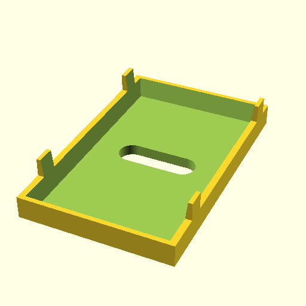

# Elna Zig Zag darning plate

A small metal formed plate that covers the transport dogs,
used in combination with the darning foot.
This enables the user to move the fabric freely under the needle,
putting down stitches all over the place.

These things are unobtainium, or via etsy for around $95

This is a 3d printed replacement, prints in 10 minutes and costs
a few cents. Knock off the corners with a file or sandpaper

The part is scripted in OpenSCAD

